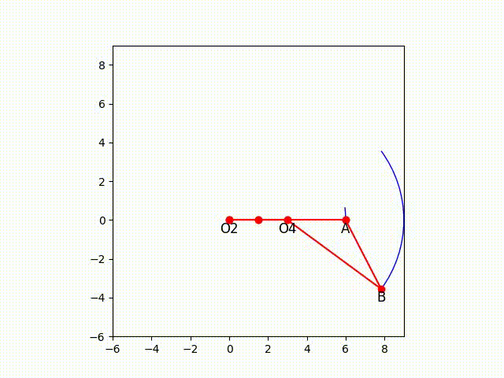

# 4R-mechanism-plotter
A simple code which plots all (almost) possible orientations for a 4R mechanism and compiles them into a video

check out a demo for Grashoff and Non-Grashoff mechanisms

  
  

Please install the following python libaries in you System. Note installing each one of these is necessary for proper functioning of code. 

1. Pandas
2. Numpy
3. matplotlib
4. OpenCV
5. os

This code is written in Jupyter Notebook. A .py version will be made available soon.
